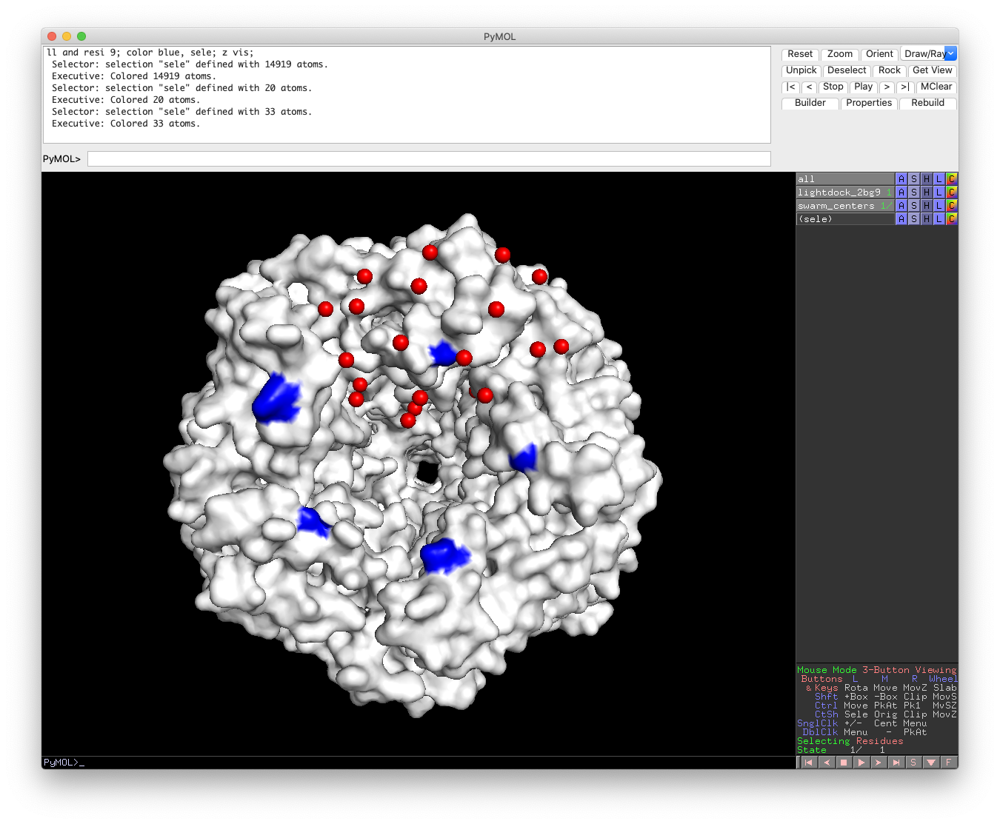
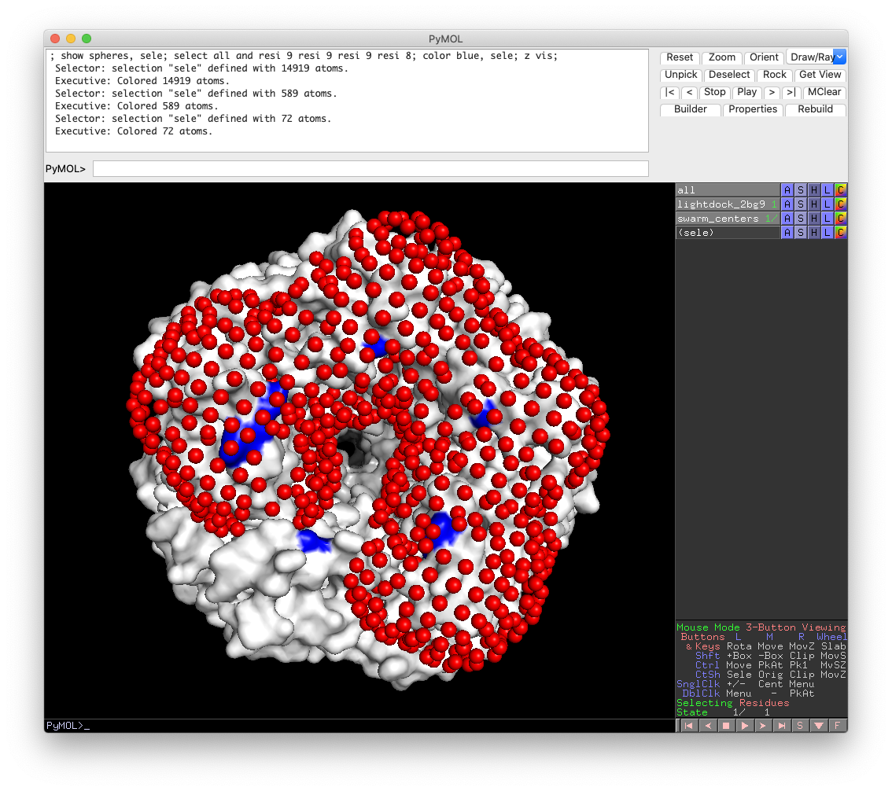
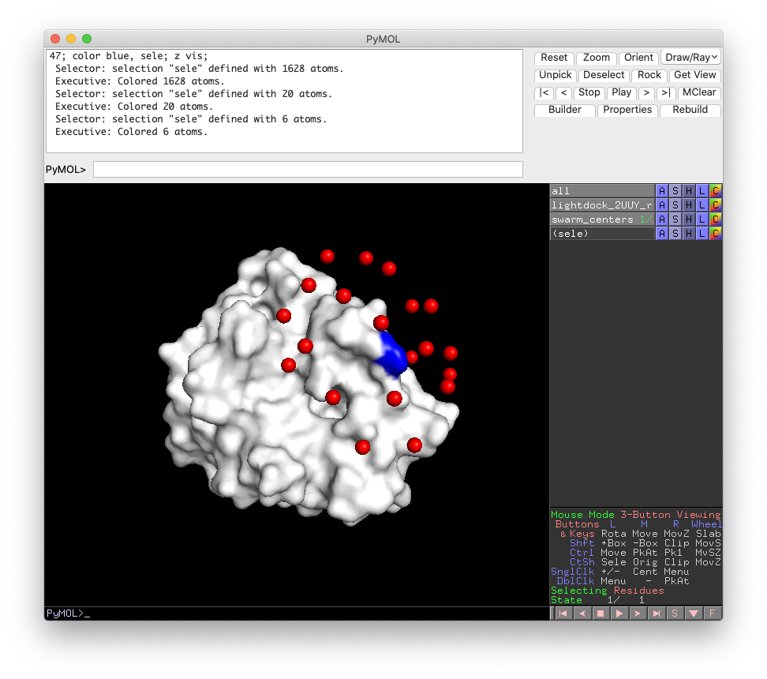

# Test Restraints

## 1PPE

### Default 1 restraint

```bash
./run.sh 1
```


### Dense sampling enabled, 1 restraint

```bash
./run.sh 1 20 -ds
```


### 40 swarms per restraint, 2 restraints

```bash
./run.sh 2 40
```


## Channel

### Default 1 restraint

```bash
./run.sh 1
```




### Dense sampling enabled, 4 restraints

```bash
./run.sh 4 20 -ds
```




## 2uuy

### Default 1 restraint

```bash
./run.sh 1
```



